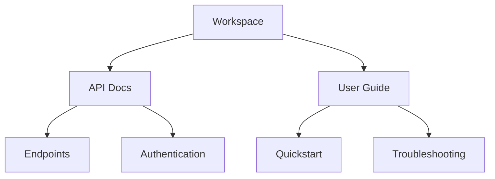

## Overview

Annelise Lawson O'BAILEY provides powerful tools to manage your project documentation efficiently. You organize content into structured spaces, collaborate with teams in real-time, track changes with version control, and find information quickly using advanced search features. These core capabilities help you maintain up-to-date, accessible docs for any project size.

<Columns cols={2}>
  <Card title="Organize & Structure" icon="folder" href="#organization">
    Build hierarchical document trees with folders and pages.
  </Card>
  <Card title="Collaborate Seamlessly" icon="users" href="#collaboration">
    Share, invite, and edit docs together.
  </Card>
  <Card title="Version Control" icon="git-branch" href="#version-control">
    Track changes and revert with confidence.
  </Card>
  <Card title="Search & Filter" icon="search" href="#search">
    Locate content instantly across your docs.
  </Card>
</Columns>

## Document Organization and Structure

You create a clear hierarchy for your documentation using folders, pages, and subpages. Start by setting up a workspace, then nest documents logically. This structure mirrors your project's architecture, making navigation intuitive.

<Steps>
  <Step title="Create Workspace" icon="home">
    Navigate to your dashboard and click "New Workspace".
  </Step>
  <Step title="Add Folders" icon="folder-plus">
    Right-click in the sidebar and select "New Folder". Name it based on project modules, like "API Reference".
  </Step>
  <Step title="Nest Pages" icon="file-plus">
    Inside folders, create MDX pages. Drag and drop to reorder.
  </Step>
</Steps>



## Collaboration and Sharing Options

Invite team members and control access levels. You share public links for read-only access or enable real-time editing for contributors.

<Tabs>
  <Tab title="Team Invite" icon="mail">
    Send invites via email. Set roles: Viewer, Editor, Admin.

    <Callout kind="tip">
      Use role-based permissions to limit changes to specific sections.
    </Callout>
  </Tab>
  <Tab title="Public Sharing" icon="globe">
    Generate shareable links with expiration dates.

````javascript
// Example: Share API response
const shareLink = await client.shareDoc({
  docId: 'doc-123',
  public: true,
  expiresAt: new Date('2024-12-31')
});
console.log(`Share this: ${shareLink.url}`);
````
  </Tab>
  <Tab title="Real-time Edits" icon="edit-3">
    Multiple users edit simultaneously with live cursors and conflict resolution.
  </Tab>
</Tabs>

## Version Control for Docs

Track every change with built-in Git-like versioning. You commit snapshots, compare diffs, and rollback as needed—no external tools required.

<CodeGroup tabs="CLI,API">
````bash
# Create a new version via CLI
annelise version create --doc-id doc-123 --message "Add auth endpoint"
annelise version list --doc-id doc-123
````

````javascript
// API example: Fetch version history
const versions = await fetch('https://api.example.com/v1/docs/doc-123/versions', {
  headers: { Authorization: `Bearer ${YOUR_API_KEY}` }
});
console.log(versions);
````
</CodeGroup>

<Callout kind="success">
  All versions are stored indefinitely. Restore any previous state in one click.
</Callout>

## Search and Filtering Capabilities

Powerful full-text search scans titles, content, and metadata. Filter by tags, authors, or dates to pinpoint exact information.

| Feature | Description | Example Query |
|---------|-------------|---------------|
| Full-Text Search | Matches across all docs | `authentication token` |
| Tag Filtering | Narrow by custom labels | `tag:api priority:high` |
| Date Range | Recent changes only | `created:>2024-10-01` |
| Author Filter | Docs by specific user | `author:john.doe` |

<ExpandableGroup>
  <Expandable title="Advanced Search Syntax" default-open="true">
    Combine operators: `"exact phrase" AND (tag:feature OR tag:bugfix) -deprecated`.
  </Expandable>
  <Expandable title="Saved Searches">
    Bookmark frequent queries for quick access from the sidebar.
  </Expandable>
</ExpandableGroup>

These features integrate seamlessly, empowering you to build professional documentation that scales with your projects.